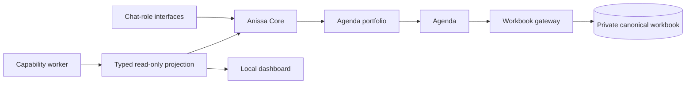
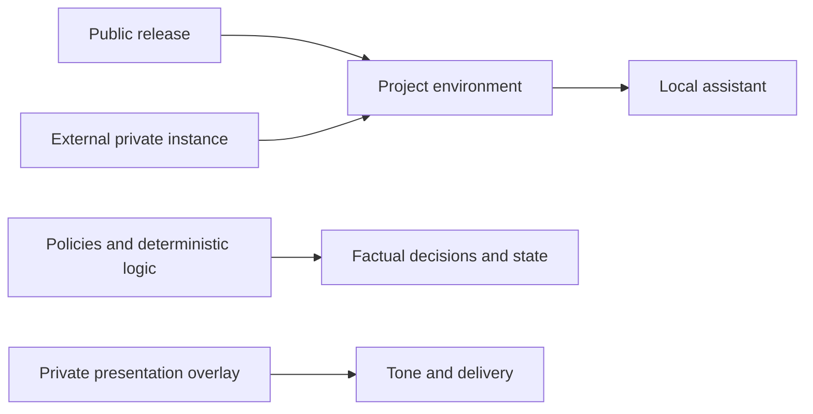

# Project Anissa

Project Anissa is a local, chat-first framework for research operations. The
repository is a reusable public release; each installation supplies an external
private instance containing its canonical workbook, profile, runtime bindings
and optional presentation overlay.

## Architecture





The private overlay can personalize tone and interaction. It cannot change
eligibility, funding, deadlines, evidence, ranking, calculations or task state.
The included clean persona is a reusable default; create personal extensions in
the external instance and never commit that instance.

## Install and verify

```bash
python3 -m venv .venv
.venv/bin/pip install -r requirements.txt
.venv/bin/python -B tools/verify.py
```

The verifier creates a temporary synthetic SETUP instance. It does not activate
automations, submit applications or create chats.

## Create a local instance

```bash
.venv/bin/python tools/init_instance.py "$HOME/Library/Application Support/Project Anissa/instances/default"
export PROJECT_ANISSA_INSTANCE="$HOME/Library/Application Support/Project Anissa/instances/default"
.venv/bin/python tools/preflight.py
```

Keep the instance directory out of version control. Replace synthetic profile
facts only through your own onboarding workflow, and require explicit go-live
authorization before binding scheduled work.

## Maintenance and publication

General, Anissa Maintainer and Soldiers Maintainer evaluate file scope before
execution. Every verified public-safe fix must reach the public release. Atomic
maintainers hand it to General, who alone generates the allowlisted projection,
runs the privacy audit and pushes it. Private-instance, private-persona and
worker-private changes remain local.

Git preserves code history; keep only current source in the checkout. After a
verified maintenance update, run `python -B worker1/a2a_cli.py ensure-server`.
The command compares `/health` with the current release build ID, replaces only
an A2A-owned stale process, and reports the deployed build ID.
