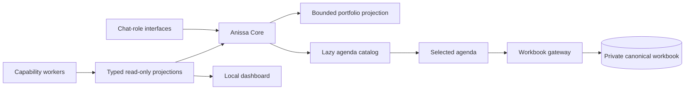
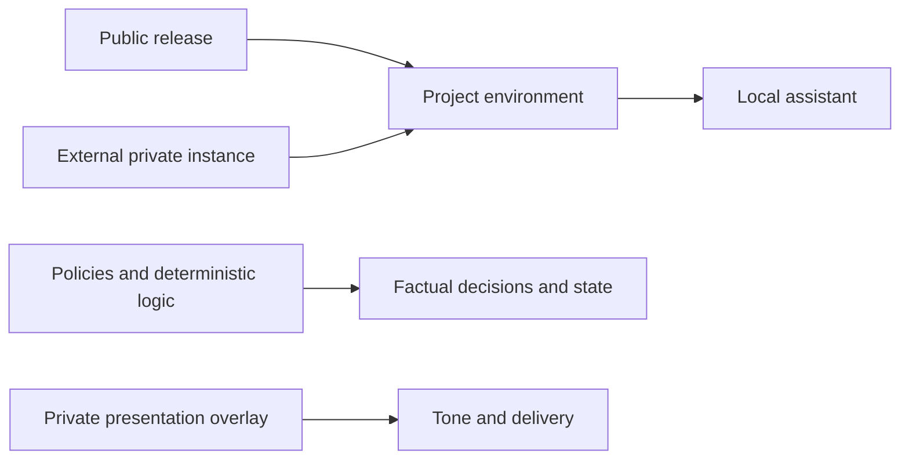

# Project Anissa

Project Anissa is a local, chat-first framework for research operations. The
repository is a reusable public release; each installation supplies an external
private instance containing its canonical workbook, profile, runtime bindings
and optional presentation overlay.

## Architecture


```mermaid
flowchart LR
    Roles[Chat-role interfaces] --> Core[Anissa Core]
    Core --> Portfolio[Bounded portfolio projection]
    Core --> Catalog[Lazy agenda catalog]
    Catalog --> Agenda[Selected agenda]
    Agenda --> Gateway[Workbook gateway]
    Gateway --> Brain[(Private canonical workbook)]
    Workers[Capability workers] --> Projection[Typed read-only projections]
    Projection --> Core
    Projection --> Dashboard[Local dashboard]
```


```mermaid
flowchart LR
    Public[Public release] --> Environment[Project environment]
    Private[External private instance] --> Environment
    Environment --> Assistant[Local assistant]
    Logic[Policies and deterministic logic] --> Facts[Factual decisions and state]
    Overlay[Private presentation overlay] --> Delivery[Tone and delivery]
```

The private overlay can personalize tone and interaction. It cannot change
eligibility, funding, deadlines, evidence, ranking, calculations or task state.
The included clean persona is a reusable default; create personal extensions in
the external instance and never commit that instance.

The clean release includes Thula as a deterministic focus-telemetry worker.
Her typed publication can inform workload context but cannot mutate an agenda,
prove task completion or become a false zero when data is missing.

Missed local runs are coalesced on the next existing scheduled wake or actual
role interaction. The shared recovery module selects current allocations or the
latest closed-week audit, not a backlog of expired notifications. Technical
receipts distinguish durable work from report delivery; delivery retries never
repeat campaign mutations. Thula backfills from one newest full-history export.
App reconnection alone is not a guaranteed wake trigger, and no extra polling
schedule is required.

## Install and verify

```bash
python3 -m venv .venv
.venv/bin/pip install -r requirements.txt
.venv/bin/python -B tools/verify.py
```

The verifier creates a temporary synthetic SETUP instance. It does not activate
automations, submit applications or create chats.
Portable regression tests and the verifier are shared with the local source.
Passing software tests does not authorize a worker or establish live workflow
acceptance; scheduling additionally requires compatible LIVE settings.

## Create a local instance

```bash
.venv/bin/python tools/init_instance.py "$HOME/Library/Application Support/Project Anissa/instances/default"
export PROJECT_ANISSA_INSTANCE="$HOME/Library/Application Support/Project Anissa/instances/default"
.venv/bin/python tools/preflight.py
```

Keep the instance directory out of version control. Replace synthetic profile
facts only through your own onboarding workflow, and require explicit go-live
authorization before binding scheduled work.

## Maintenance and publication

Argal, Regent Thrag and General Kreg evaluate file scope before
execution. Every verified public-safe fix must reach the public release. Atomic
maintainers hand it to Argal, who alone generates the allowlisted projection,
runs the privacy audit and pushes it. Private-instance, private-persona and
worker-private changes remain local.
Cross-scope work uses explicit contract, acknowledgment, verified handoff,
integration and publication checkpoints. Only one maintainer writes a file
scope at a time, and silence never signals acceptance.

Git preserves code history; keep only current source in the checkout. After a
verified maintenance update, run `python -B soldiers/thula/cli.py ensure-server`.
The command compares `/health` with the current release build ID, replaces only
a Thula-owned stale process, and reports the deployed build ID.
